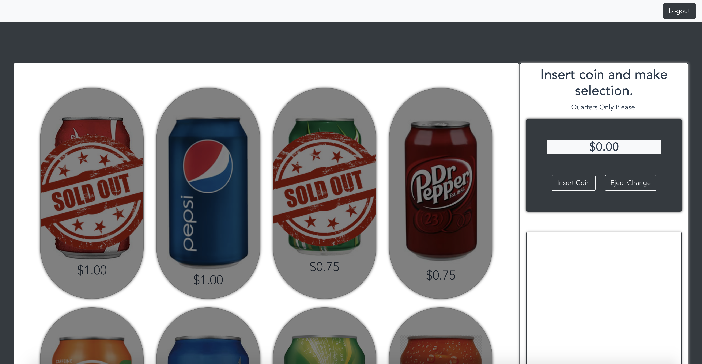

# eduity-vending-machine

## Live Version: 

Click [HERE](https://eduity-vending-machine.web.app) to check out the deployed version.

## Description
This project is my submission to the Eduity Client Side Programming Challenge.  For this challenge, I was tasked with implementing a functional UI that simulates a soda vending machine.  After authenticating into the application, users are presented with a selection of sodas that they are able to purchase, and after inserting the proper amount of quarters they are able to click on their choice of soda and see that soda dispensed.  Any sodas that are sold out will be indicated by an overlaid graphic on the screen.  The user can also decide to eject quarters if they change their mind on buying a soda.  When a soda is purchased, a record of that purchase is saved to a realtime Firebase database and the quantity of the selected soda is also updated in the database.

## Project Requirements

- State: This application must be able to switch between and respond to 4 states:
    - No quarters
    - Has quarters
    - Sold
    - Sold out

- Actions: Users must be able to perfom the following actions in the application:
    - Insert quarter(s)
    - Remove quarter(s)
    - Push the desired soda button
    - Dispense the soda

## Techonolgies Used
- Axios 0.21.0
- Bootstrap 4.5.3
- Bootstrap-vue 2.18.1
- Core-js 3.6.5
- ES6 JavaScript
- Firebase 8.0.0
    - Firebase Authentication
    - Firebase Realtime Database
- Font Awesome 5.15.1
- HTML5
- CSS3/SCSS
- Moment 2.29.1
- Vue 2.6.12

## Screenshots




## How To Run
1. Clone down this repository to a local directory of your choosing.
2. `cd` into the repository and run `npm install` in your terminal.
3. Create a new Firebase project [HERE](https://console.firebase.google.com/).
4. At `src/helpers`, create a `apiKeys.json` file.  Within this file, insert the Firebase keys that were generated at the creation of your new Firebase project.  Please reference `apiKeys.example.json` to structure this file correctly.  Double check that `apiKeys.json` is included in the `.gitignore` file.
5. In your new Firebase project, in the sidebar on the left, select `Realtime Database`.  Next, click the button that says, `Create Database` at appears at the top.  In the subsequent modal that appears, select `Start in test mode` and click `Enable`.
6. In the next screen, you will need to upload the seed data.  Click on the vertical ellipsis icon at the right of the screen and select `Import JSON`.  Next, select `Browse`.  You will need to then navigate to the current project directory and find the folder labeled `db` which contains our seed JSON files.  First, upload the file called `!base.json`.  Then, click on each node of the `!base.json` file in Firebase (players, question_options, questions, etc.) and upload each respective JSON file in the `db` directory.
7. Next, click on the tab labeled `Rules` in Firebase and make sure the rules object looks like the following: 
```js
{
  "rules": {
    ".read": "now < 1607061600000",  // 2020-12-4
    ".write": "now < 1607061600000",  // 2020-12-4
    "customers": {
    ".indexOn": "email"
  	}
  }
}
```
7. In your terminal in the project directory, run `npm run serve`.  You should then be be to navigate to `localhost:8080` and the app should be up and running.  If this is not the case, run `hs -p 8080` and then navigate to [https://localhost:8080](https://localhost:8080).